<div align="center">
  
</div>

---

# ⚙️ PIC Conveyor — PIC18F4550 · MPLAB X 6.25 · XC8 · HC-SR04 · HC-05

<div align="center">


**Sistema embebido para una banda transportadora con conteo automático de piezas, control de velocidad por PWM, monitoreo por Bluetooth y recuperación de estado mediante EEPROM.**

[🧾 Autor](#-autor) • [🏗️ Arquitectura](#️-arquitectura-del-sistema) • [🧠 Diagramas del código](#-diagramas-del-código) • [🚀 Compilación](#-compilación-y-programación)

</div>

---

## 📖 Resumen Ejecutivo

**PIC Conveyor** es un proyecto de automatización embebida desarrollado sobre un **PIC18F4550**, orientado al control de una **banda transportadora** con capacidad de:

- definir un **objetivo de conteo** desde un teclado matricial,
- detectar piezas con un **sensor ultrasónico HC-SR04**,
- regular la velocidad del motor mediante **PWM**,
- supervisar y operar el sistema por **Bluetooth HC-05**,
- mostrar información en **LCD 16x2**, **display de 7 segmentos**, **LED RGB** y **buzzer**,
- recuperar el proceso tras una falla de energía usando **EEPROM interna**,
- reducir consumo mediante **apagado de backlight** y **modo sleep por inactividad**.

El firmware está implementado en **C para XC8**, con una arquitectura basada en **máquina de estados**, **rutinas auxiliares**, **interrupciones** y uso coordinado de periféricos internos del PIC.

### Características Principales

- ✅ **Conteo automático de piezas** con ventana de detección entre **5 cm y 8 cm**
- ✅ **Control dual del motor**: potenciómetro por ADC o comandos Bluetooth
- ✅ **PWM por CCP1** con frecuencia aproximada de **1 kHz**
- ✅ **Interfaz local completa** con teclado 4x4, LCD, display y buzzer
- ✅ **Telemetría serial/Bluetooth** con reporte periódico de PWM y distancia
- ✅ **Recuperación tras apagado** con almacenamiento en EEPROM
- ✅ **Parada de emergencia** por teclado o comando remoto
- ✅ **Modo de ahorro de energía** por inactividad

---

## 🖼️ Recursos del Proyecto

<div align="center">

| Recurso | Descripción | Vista |
|:------:|:------------|:-----:|
| **Montaje** | Ensamble físico de la banda y la electrónica |  |
| **Conexiones** | Cableado real del prototipo en protoboard |  |
| **Esquemático** | Diagrama general del sistema electrónico |  |

</div>

---

## 🧾 Autor

<div align="center">

| Autor | Rol |
|:------|:----|
| **Samuel David Sanchez Cardenas** | Diseño del sistema, firmware embebido, integración electrónica y documentación |

</div>

---

## 📋 Tabla de Contenidos

1. [Introducción](#-introducción)
2. [Objetivos](#-objetivos)
3. [Arquitectura del Sistema](#️-arquitectura-del-sistema)
   - [Diagrama General de Componentes](#diagrama-general-de-componentes)
   - [Mapa Funcional del Firmware](#mapa-funcional-del-firmware)
   - [Máquina de Estados](#máquina-de-estados-principal)
4. [Diagramas del Código](#-diagramas-del-código)
   - [Flujo General de `main`](#1-flujo-general-de-main)
   - [Diagrama Detallado de Estados](#2-diagrama-detallado-de-estados)
   - [Interrupciones](#3-diagrama-de-la-función-de-interrupción-isr)
   - [`LeerYtransmitir()`](#4-diagrama-de-leerytransmitir)
   - [`ProcesarOrden()`](#5-diagrama-de-procesarorden)
   - [`MedirDistancia()`](#6-diagrama-de-medirdistancia)
   - [`valuePWM()`](#7-diagrama-de-valuepwm)
   - [`EEPROM_Read()` y `EEPROM_Write()`](#8-diagrama-de-eeprom_read-y-eeprom_write)
5. [Instalación y Configuración](#-instalación-y-configuración)
6. [Estructura del Proyecto](#-estructura-del-proyecto)
7. [Hardware del Sistema](#-hardware-del-sistema)
8. [Firmware Embebido](#-firmware-embebido)
   - [Inicialización](#1-inicialización)
   - [Gestión de reset](#2-gestión-de-reset)
   - [Conteo por ultrasonido](#3-conteo-por-ultrasonido)
   - [PWM y control del motor](#4-pwm-y-control-del-motor)
   - [Comunicación Bluetooth](#5-comunicación-bluetooth)
   - [Interfaz local](#6-interfaz-local)
   - [EEPROM](#7-recuperación-con-eeprom)
   - [Ahorro de energía](#8-gestión-de-inactividad-y-sleep)
9. [Compilación y Programación](#-compilación-y-programación)
10. [Uso del Sistema](#-uso-del-sistema)
11. [Comandos Bluetooth](#-comandos-bluetooth)
12. [Troubleshooting](#-troubleshooting)
13. [Conclusiones](#-conclusiones)
14. [Referencias](#-referencias)
15. [Licencia](#-licencia)
16. [Referencia Rápida](#-referencia-rápida-de-comandos)

---

## 📖 Introducción

Este proyecto implementa un sistema de control para una **banda transportadora de conteo**, integrando sensado, actuación, visualización y comunicación inalámbrica en una única plataforma basada en microcontrolador.

La lógica del sistema permite:

- iniciar el proceso desde una interfaz local,
- definir una meta de conteo entre **1 y 59 piezas**,
- detectar automáticamente cada pieza que entra en la ventana del sensor,
- actualizar el conteo local y remoto en tiempo real,
- reiniciar el conteo o cambiar el modo de control del motor,
- conservar el estado en memoria no volátil ante una caída de energía.

---

## 🎯 Objetivos

### Objetivo General

Desarrollar un sistema embebido con **PIC18F4550** para el control de una banda transportadora capaz de contar piezas automáticamente, ajustar la velocidad del motor y mantener el estado del proceso ante fallas de energía.

### Objetivos Específicos

1. Implementar una **máquina de estados** para organizar la lógica del sistema.
2. Integrar un **sensor ultrasónico HC-SR04** para detectar piezas en una ventana de conteo.
3. Generar una señal **PWM** para regular la velocidad del motor.
4. Permitir control dual del motor: **potenciómetro** y **Bluetooth**.
5. Mostrar el estado del sistema en **LCD 16x2**, **display de 7 segmentos**, **LED RGB** y **buzzer**.
6. Guardar el progreso del conteo en **EEPROM** para recuperación tras apagados.
7. Incorporar una **parada de emergencia** segura.
8. Mantener compatibilidad con **MPLAB X IDE v6.25** y **XC8 v3.10**.

---

## 🏗️ Arquitectura del Sistema

### Diagrama General de Componentes

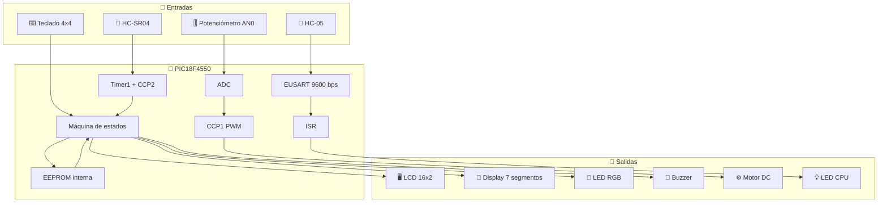

### Mapa Funcional del Firmware

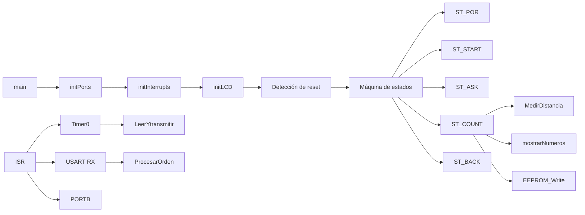

### Máquina de Estados Principal

El firmware trabaja con esta máquina de estados:

```c
typedef enum {
    ST_POR,
    ST_START,
    ST_ASK,
    ST_COUNT,
    ST_BACK
} EstadoSistema_t;
```

#### Descripción de Estados

- **`ST_POR`**: pregunta si se desea restaurar el conteo guardado en EEPROM tras una condición de reinicio asociada a energía.
- **`ST_START`**: ejecuta la animación de bienvenida e inicializa variables.
- **`ST_ASK`**: solicita el objetivo de piezas a contar.
- **`ST_COUNT`**: ejecuta la rutina de medición y conteo.
- **`ST_BACK`**: espera confirmación para reiniciar el ciclo.

---

## 🧠 Diagramas del Código

## 1. Flujo General de `main`

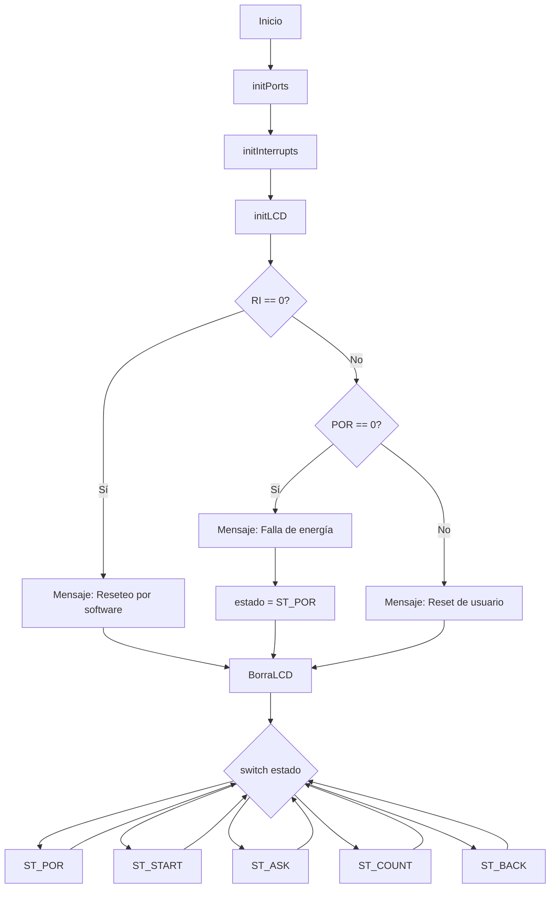

---

## 2. Diagrama Detallado de Estados

### `ST_POR`

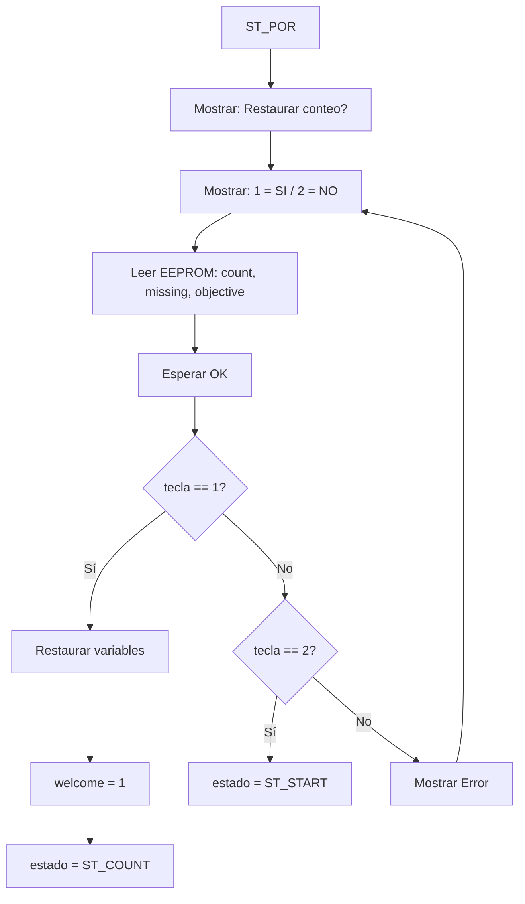

### `ST_START`

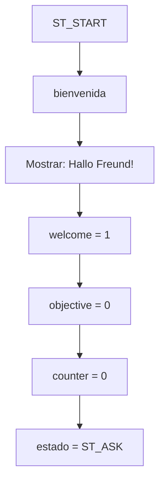

### `ST_ASK`

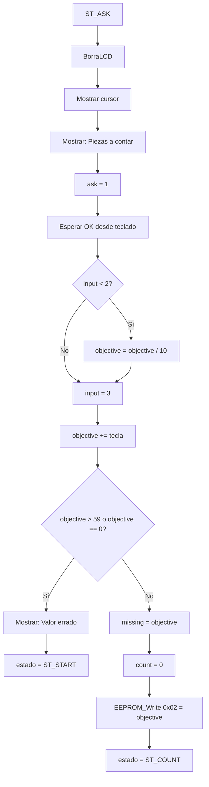

### `ST_COUNT`

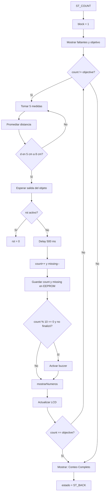

### `ST_BACK`

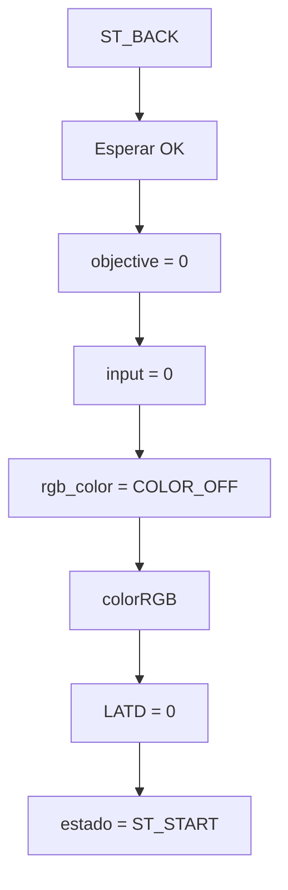

---

## 3. Diagrama de la Función de Interrupción `ISR`

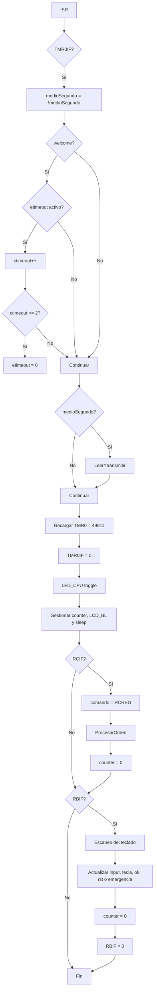

### Temporización de `Timer0`

Con `Fosc = 1 MHz`, Timer0 en modo de 16 bits, reloj interno y prescaler `1:8`, con recarga `49911`, la interrupción ocurre aproximadamente cada **500 ms**. A partir de eso:

- `LeerYtransmitir()` se ejecuta cada **1 segundo**,
- el backlight se apaga después de **20 interrupciones** (~10 s),
- el sistema entra en **sleep** después de **40 interrupciones** (~20 s).

---

## 4. Diagrama de `LeerYtransmitir()`

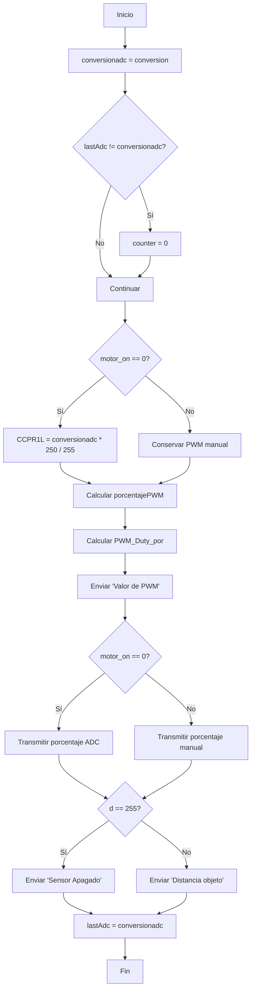

---

## 5. Diagrama de `ProcesarOrden()`

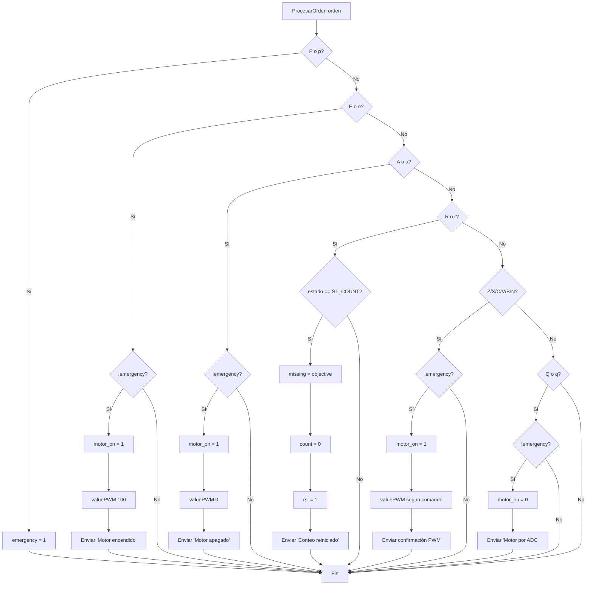

### Mapeo de comandos Bluetooth

| Comando | Acción |
|:--------|:-------|
| `P` / `p` | Activa emergencia |
| `E` / `e` | Motor encendido al 100% |
| `A` / `a` | Motor apagado |
| `R` / `r` | Reinicia el conteo |
| `Z` / `z` | PWM 0% |
| `X` / `x` | PWM 20% |
| `C` / `c` | PWM 40% |
| `V` / `v` | PWM 60% |
| `B` / `b` | PWM 80% |
| `N` / `n` | PWM 100% |
| `Q` / `q` | Regresa a control por ADC |

---

## 6. Diagrama de `MedirDistancia()`

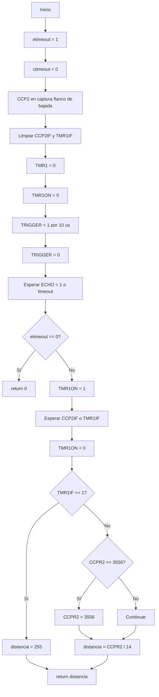

### Lógica usada por el conteo

En `ST_COUNT` no se toma una única medición. El sistema:

1. realiza **5 lecturas consecutivas**,
2. calcula el promedio,
3. verifica si el objeto está entre `UMBRAL_MIN` y `UMBRAL_MAX`,
4. espera a que el objeto salga del rango,
5. incrementa el conteo.

Esto actúa como un filtro simple contra ruido o lecturas inestables.

---

## 7. Diagrama de `valuePWM()`

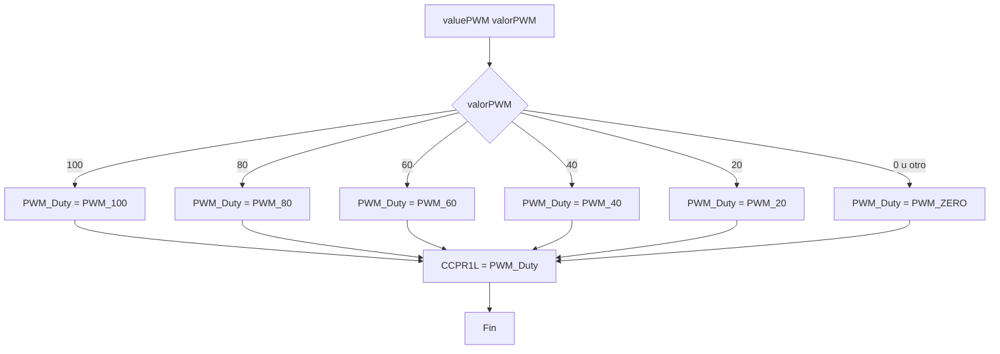

---

## 8. Diagrama de `EEPROM_Read()` y `EEPROM_Write()`

### `EEPROM_Read()`

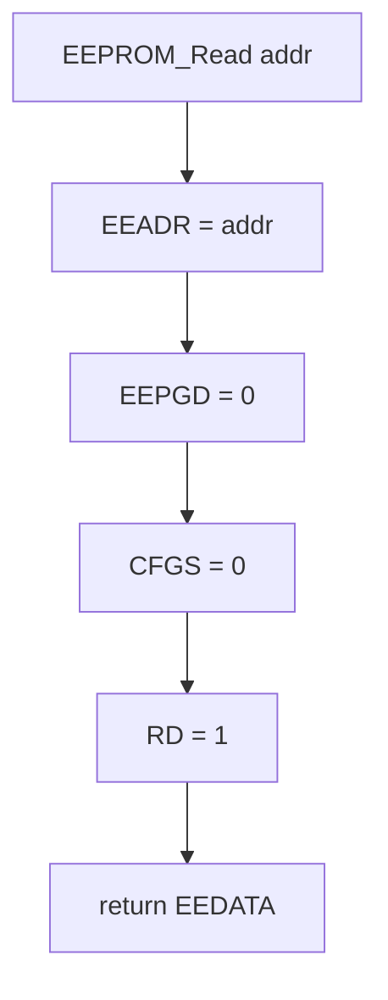

### `EEPROM_Write()`

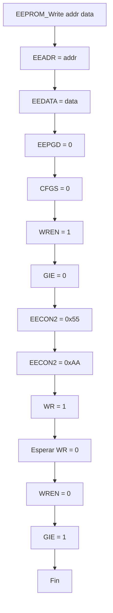

---

## 📥 Instalación y Configuración

### Requisitos del Entorno

| Componente | Versión / Valor |
|:-----------|:----------------|
| IDE | **MPLAB X IDE 6.25** |
| Compilador | **XC8 3.10** |
| Microcontrolador | **PIC18F4550** |
| Lenguaje | **C embebido** |
| Frecuencia definida | **1 MHz** (`_XTAL_FREQ 1000000`) |
| Comunicación serial | **9600 bps** |
| Proyecto MPLAB | `pic-conveyor.X` |

### Configuración Relevante del Firmware

```c
#define _XTAL_FREQ 1000000

#pragma config FOSC=INTOSC_EC
#pragma config WDT=OFF
#pragma config BOR=OFF
#pragma config STVREN=OFF
#pragma config PBADEN=OFF
#pragma config LVP=OFF
```

### Configuración Observada del Proyecto

- **Target Device:** `PIC18F4550`
- **Toolchain:** `XC8`
- **Versión esperada del compilador:** `3.10`

---

## 📁 Estructura del Proyecto

```text
PIC-Conveyor/
├── img/
│   ├── assembly.png
│   ├── connections.png
│   └── schematic.png
└── pic-conveyor.X/
    ├── build/
    │   └── default/
    │       └── production/
    ├── debug/
    │   └── default/
    ├── dist/
    │   └── default/
    │       └── production/
    ├── nbproject/
    │   └── private/
    ├── LibLCDXC8.h
    ├── Makefile
    └── pic-conveyor.c
```

### Archivos Clave

| Archivo | Descripción |
|:--------|:------------|
| `pic-conveyor.c` | Firmware principal del sistema |
| `LibLCDXC8.h` | Librería de manejo del LCD |
| `img/assembly.png` | Foto del montaje físico |
| `img/connections.png` | Vista del cableado real |
| `img/schematic.png` | Esquemático general del sistema |
| `dist/default/production/pic-conveyor.X.production.hex` | Archivo HEX generado al compilar |

---

## 🔧 Hardware del Sistema

### Componentes Identificados

| Componente | Función |
|:-----------|:--------|
| **PIC18F4550** | Unidad de control principal |
| **LCD 16x2** | Visualización de mensajes y conteo |
| **Teclado matricial 4x4** | Entrada local de datos y control |
| **HC-SR04** | Detección de piezas por distancia |
| **HC-05** | Comunicación Bluetooth |
| **Motor DC** | Movimiento de la banda transportadora |
| **TIP31** | Etapa de manejo del motor |
| **Potenciómetro** | Ajuste analógico de velocidad |
| **LED RGB** | Indicador de estado y rango de conteo |
| **Display 7 segmentos** | Visualización de la unidad del conteo |
| **Buzzer** | Alarmas sonoras |
| **LED CPU** | Indicador de actividad del sistema |

### Pines Relevantes del Código

| Recurso | Pin |
|:--------|:----|
| `TRIGGER` | `RC0` |
| `ECHO` | `RC1` |
| `LED_CPU` | `LATA1` |
| `BUZZER` | `LATA2` |
| `LCD_BL` | `LATA5` |
| Display / contador visual | `LATD` |
| LED RGB | `LATE` |
| Teclado matricial | `PORTB` |
| PWM del motor | `CCP1` |
| Captura ultrasónica | `CCP2` |

### Vista del Montaje

<div align="center">
  
  <p><em>Montaje físico del prototipo de banda transportadora con la electrónica de control.</em></p>
</div>

### Vista de Conexiones

<div align="center">
  
  <p><em>Implementación física sobre protoboard con LCD, teclado, PIC, display y periféricos.</em></p>
</div>

### Esquemático

<div align="center">
  
  <p><em>Esquemático general del sistema embebido.</em></p>
</div>

---

## 💻 Firmware Embebido

### Descripción General

El firmware fue desarrollado en **C** para **XC8** y organiza sus funciones a través de:

- una **máquina de estados global**,
- **funciones auxiliares** para PWM, LCD, Bluetooth, EEPROM y ultrasonido,
- una **rutina de interrupción única** que atiende Timer0, recepción serial y teclado.

---

### 1. Inicialización

En `main()` se ejecuta esta secuencia:

```c
initPorts();
initInterrupts();
initLCD();
```

#### `initPorts()`

Configura:

- **EUSART** para Bluetooth a 9600 bps,
- **ADC** en `AN0`,
- **CCP1** como PWM,
- **Timer2** para la base del PWM,
- **Timer1 + CCP2** para medición ultrasónica,
- direcciones `TRISx` y salidas `LATx`,
- encendido inicial del backlight del LCD.

#### `initInterrupts()`

Habilita:

- interrupción por recepción serial (`RCIE`),
- interrupción por cambio en PORTB (`RBIE`),
- interrupción por overflow de Timer0 (`TMR0IE`),
- interrupciones globales (`GIE`) y periféricas (`PEIE`).

---

### 2. Gestión de reset

El sistema distingue tres escenarios al arrancar:

```c
if(RI == 0) {
    // Reseteo por software
} else if(POR == 0) {
    // Falla de energía
    estado = ST_POR;
} else {
    // Reset de usuario
}
```

Esto permite decidir si se debe ofrecer una restauración del conteo previo.

---

### 3. Conteo por ultrasonido

El conteo usa el HC-SR04 y dos umbrales:

```c
#define UMBRAL_MIN 5
#define UMBRAL_MAX 8
```

La detección se considera válida cuando la distancia promedio de 5 muestras está en ese rango. Después se espera a que el objeto abandone la ventana antes de contar la siguiente pieza.

#### Variables de conteo

| Variable | Descripción |
|:---------|:------------|
| `objective` | Meta total de piezas |
| `count` | Piezas contadas |
| `missing` | Piezas faltantes |
| `rst` | Solicitud de reinicio de conteo |
| `d` | Distancia promedio usada en lógica de conteo |

---

### 4. PWM y control del motor

El motor se controla con **CCP1** usando niveles discretos de duty:

```c
typedef enum {
    PWM_ZERO=1,
    PWM_20=50,
    PWM_40=100,
    PWM_60=150,
    PWM_80=200,
    PWM_100=250,
} DutyPWM_t;
```

### Modos de operación del motor

| Modo | Descripción |
|:-----|:------------|
| **ADC** | `motor_on = 0`, el PWM depende del potenciómetro |
| **Bluetooth** | `motor_on = 1`, el PWM se fija por comando |

### Conversión por ADC

```c
if(motor_on == 0)
    CCPR1L = (unsigned int)conversionadc * 250 / 255;
```

Esto escala el valor de `ADRESH` al rango de trabajo del PWM.

---

### 5. Comunicación Bluetooth

La interfaz Bluetooth usa EUSART con esta configuración:

```c
TXSTA = 0b00100100;
RCSTA = 0b10010000;
BAUDCON = 0b00001000;
SPBRG = 25;
```

### Qué transmite el sistema

`LeerYtransmitir()` envía periódicamente:

- el porcentaje de PWM actual,
- la lectura del sensor,
- mensajes asociados a acciones remotas.

Ejemplo:

```text
Valor de PWM: 080%
Distancia objeto: 06 cm
```

o:

```text
Sensor Apagado
```

---

### 6. Interfaz local

#### Teclado 4x4

Funciones implementadas:

- `1..9`, `0`: entrada numérica
- `OK`: confirma la entrada
- `DELETE`: borra el último dígito
- `RESET`: reinicia el conteo
- `FORCE END`: fuerza `count = objective`
- `LIGHT`: conmuta el backlight del LCD
- tecla de **emergencia**: activa `emergency = 1`

#### LCD 16x2

Mensajes utilizados por el firmware:

- `"Falla de energia"`
- `"Restaurar conteo?"`
- `"1=SI   2=NO"`
- `"Hallo Freund!"`
- `"Piezas a contar:"`
- `"Valor errado"`
- `"Faltantes :"`
- `"Objetivo :"`
- `"Conteo Completo!"`
- `"EMERGENCY STOP"`

#### Display de 7 segmentos

```c
LATD = count % 10;
```

Se usa para mostrar la **unidad** del conteo actual.

#### LED RGB

El color depende del rango de conteo:

| Conteo | Color |
|:-------|:------|
| 0–9 | Magenta |
| 10–19 | Azul |
| 20–29 | Cyan |
| 30–39 | Verde |
| 40–49 | Amarillo |
| 50–59 | Blanco |
| Emergencia | Rojo |
| Espera / fin | Off |

#### Buzzer

- suena cada **10 piezas**,
- suena al completar el conteo,
- acompaña la notificación final.

---

### 7. Recuperación con EEPROM

El sistema almacena tres valores:

| Dirección | Variable |
|:----------|:---------|
| `0x00` | `count` |
| `0x01` | `missing` |
| `0x02` | `objective` |

#### Cuándo se escribe

- al definir el objetivo,
- al actualizar `count` y `missing` durante el conteo.

#### Cuándo se lee

- en `ST_POR`, cuando se ofrece restaurar el estado previo.

---

### 8. Gestión de inactividad y sleep

La variable `counter` se incrementa en la ISR de Timer0.

### Comportamiento

| Valor de `counter` | Acción |
|:-------------------|:-------|
| `< 20` | Sistema activo |
| `20 a 39` | Apaga `LCD_BL` |
| `>= 40` | PWM a cero y `SLEEP()` |

Además:

- cualquier interacción por teclado o Bluetooth pone `counter = 0`,
- si el sistema estaba inactivo y vuelve a haber actividad, se reactiva el backlight.

---

## 🛠️ Compilación y Programación

### Abrir el proyecto

1. Abrir **MPLAB X IDE 6.25**
2. Seleccionar **File → Open Project**
3. Abrir la carpeta:

```text
pic-conveyor.X
```

### Verificar configuración

Asegúrate de usar:

- **Device:** `PIC18F4550`
- **Compiler:** `XC8 v3.10`

### Compilar

Desde MPLAB:

- **Clean and Build Project**

El archivo generado quedará en:

```text
pic-conveyor.X/dist/default/production/pic-conveyor.X.production.hex
```

### Programar el microcontrolador

Puedes usar el programador o debugger configurado en MPLAB X.  
Si el proyecto está en simulación, cambia la herramienta antes de cargar el firmware al hardware real.

---

## 🚀 Uso del Sistema

### Flujo básico de operación

1. Energizar el sistema.
2. Si aparece el mensaje de restauración, elegir:
   - `1` para restaurar,
   - `2` para iniciar desde cero.
3. Esperar la animación de bienvenida.
4. Ingresar el objetivo de conteo con el teclado.
5. Confirmar con **OK**.
6. Ajustar la velocidad del motor:
   - con el **potenciómetro**, o
   - con **Bluetooth**.
7. Dejar pasar las piezas frente al sensor ultrasónico.
8. Supervisar:
   - faltantes en LCD,
   - objetivo en LCD,
   - unidad del conteo en 7 segmentos,
   - color RGB según el rango,
   - telemetría Bluetooth.
9. Al completar el objetivo, el sistema muestra **“Conteo Completo!”**.
10. Presionar **OK** para reiniciar el ciclo.

---

## 📶 Comandos Bluetooth

### Tabla rápida

| Comando | Descripción |
|:--------|:------------|
| `P` | Emergencia |
| `E` | Motor encendido al 100% |
| `A` | Motor apagado |
| `R` | Reinicio del conteo |
| `Z` | PWM 0% |
| `X` | PWM 20% |
| `C` | PWM 40% |
| `V` | PWM 60% |
| `B` | PWM 80% |
| `N` | PWM 100% |
| `Q` | Volver a control por potenciómetro / ADC |

### Ejemplo de sesión

```text
> X
Motor PWM a 20

> B
Motor PWM a 80

> Q
Motor por ADC
```

---

## 🐛 Troubleshooting

### ❌ El proyecto no compila en MPLAB

**Posibles causas**
- XC8 no instalado,
- versión distinta a la del proyecto,
- apertura incorrecta del proyecto.

**Solución**
- verificar que MPLAB detecte **XC8 v3.10**,
- abrir la carpeta **`pic-conveyor.X`** y no solo el archivo `.c`.

---

### ❌ El LCD no muestra información

**Revisar**
- alimentación,
- contraste,
- cableado del LCD,
- la librería `LibLCDXC8.h`,
- backlight controlado por `LATA5`.

---

### ❌ El sistema no cuenta piezas

**Revisar**
- posición física del HC-SR04,
- que `TRIGGER` esté en `RC0`,
- que `ECHO` esté en `RC1`,
- que el objeto cruce la ventana entre **5 cm y 8 cm**,
- que el objeto no permanezca fijo dentro del rango.

---

### ❌ El motor no responde

**Revisar**
- transistor **TIP31**,
- alimentación del motor,
- señal PWM en CCP1,
- valor de `CCPR1L`,
- si el sistema entró en sleep por inactividad.

---

### ❌ No hay comunicación por Bluetooth

**Revisar**
- emparejamiento del **HC-05**,
- baudrate de **9600 bps**,
- conexiones TX/RX,
- alimentación del módulo,
- que `RCIF` esté ocurriendo al recibir datos.

---

### ❌ El sistema entra en emergencia y no sale

La rutina de emergencia es intencionalmente bloqueante:

```c
while(1) {
    valuePWM(0);
    GIE = 0;
    SLEEP();
}
```

**Importante:** para salir de este estado se requiere reiniciar el sistema.

---

### ❌ El backlight se apaga muy rápido

Eso no necesariamente es una falla. El firmware implementa ahorro de energía:

- ~10 s: se apaga el LCD,
- ~20 s: entra en sleep.

Cualquier actividad de teclado o Bluetooth reinicia el contador de inactividad.

---

## 🎓 Conclusiones

Este proyecto demuestra una integración sólida de conceptos de sistemas embebidos:

- máquinas de estado,
- manejo de interrupciones,
- PWM con CCP1,
- ADC para control analógico,
- EUSART para Bluetooth,
- Timer1 + CCP2 para medición ultrasónica,
- memoria EEPROM para persistencia,
- interfaz local y remota sobre un solo microcontrolador.

El resultado es un sistema funcional de automatización a pequeña escala, con una lógica clara, mecanismos de recuperación y una estrategia simple pero efectiva de supervisión y ahorro de energía.

### Posibles Mejoras Futuras

1. reemplazar el sensado ultrasónico por barrera óptica para mayor robustez en conteo rápido,
2. registrar más variables en EEPROM o memoria externa,
3. agregar menús de configuración en LCD,
4. implementar más estados de diagnóstico,
5. añadir inversión de giro del motor,
6. migrar el diseño a una PCB dedicada.

---

## 📚 Referencias

1. **Microchip** — Documentación del **PIC18F4550**
2. **Microchip** — Manual del compilador **XC8**
3. **MPLAB X IDE** — Entorno de desarrollo para microcontroladores PIC
4. **HC-SR04** — Hoja de datos del sensor ultrasónico
5. **HC-05** — Documentación de configuración serial Bluetooth
6. **LCD 16x2 HD44780** — Referencia de comandos e interfaz
7. Código fuente del proyecto:
   - `pic-conveyor.c`
   - `LibLCDXC8.h`


---

## 📧 Contacto

**Samuel David Sanchez Cardenas**  
Autor único del proyecto

---

<div align="center">
  
  
  **⚙️ Desarrollado en C embebido para automatización con PIC ⚙️**
  
  ⭐ Si este proyecto te fue útil, considera darle una estrella al repositorio ⭐
</div>
