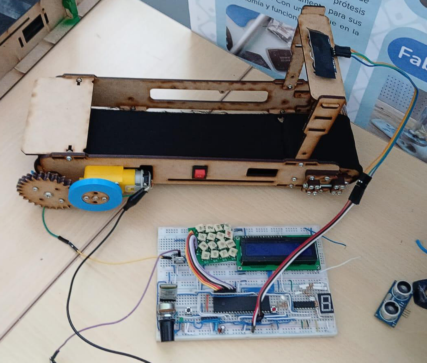
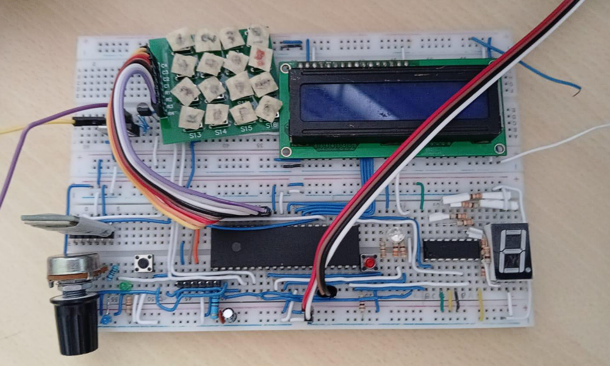
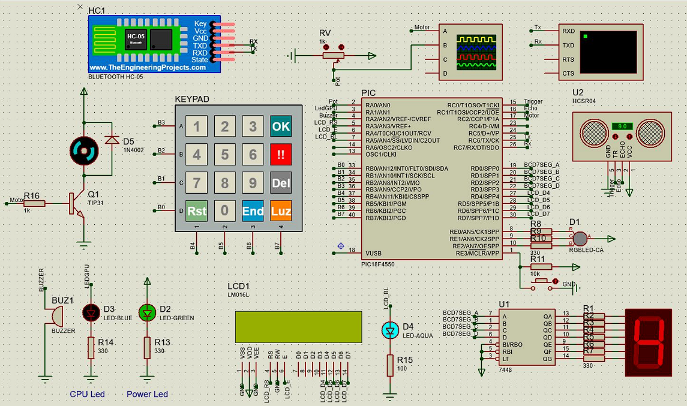
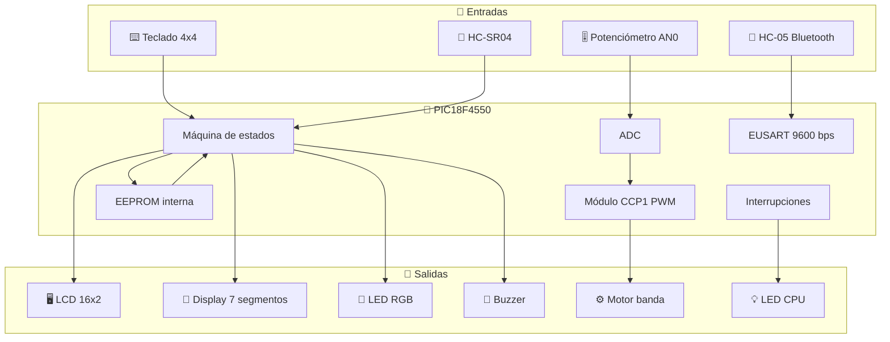
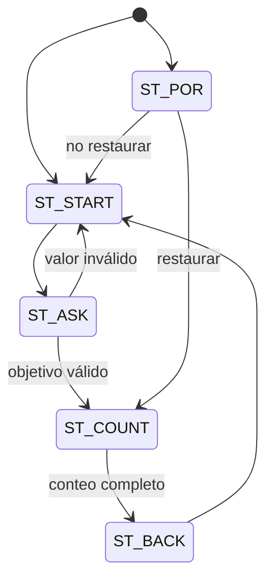
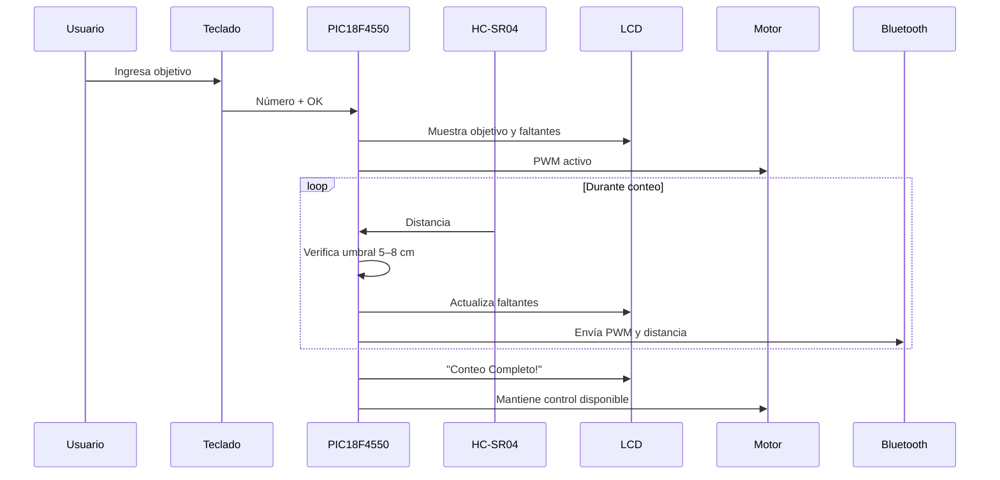

<div align="center">
  
</div>

---

# ⚙️ PIC Conveyor — PIC18F4550 · MPLAB X 6.25 · XC8 · HC-SR04 · HC-05

<div align="center">


**Sistema embebido para una banda transportadora con conteo automático de piezas, control de velocidad por PWM, monitoreo por Bluetooth y recuperación de estado mediante EEPROM.**

[🧾 Autores](#-autores) • [🏗️ Arquitectura](#️-arquitectura-del-sistema) • [🚀 Compilación](#-compilación-y-programación) • [📖 Documentación](#-tabla-de-contenidos)

</div>

---

## 📖 Resumen Ejecutivo

**PIC Conveyor** es un proyecto de automatización embebida desarrollado sobre un **PIC18F4550**, orientado al control de una **banda transportadora** con capacidad de:

- definir un **objetivo de conteo** desde teclado matricial,
- detectar piezas con un **sensor ultrasónico HC-SR04**,
- controlar la velocidad del motor mediante **PWM**,
- supervisar y operar el sistema por **Bluetooth HC-05**,
- mostrar información en **LCD 16x2**, **display de 7 segmentos**, **LED RGB** y **buzzer**,
- recuperar el proceso tras una falla de energía usando **EEPROM interna**.

El firmware está implementado en **C para XC8**, con una arquitectura basada en **máquina de estados**, interrupciones y periféricos internos del microcontrolador.

### Características Principales

- ✅ **Conteo automático de piezas** con sensor ultrasónico
- ✅ **Control de velocidad por PWM** desde potenciómetro o Bluetooth
- ✅ **Interfaz local completa** con teclado 4x4, LCD, display y buzzer
- ✅ **Telemetría serial/Bluetooth** a 9600 bps
- ✅ **Recuperación tras apagado** con almacenamiento en EEPROM
- ✅ **Parada de emergencia** por teclado o comando remoto
- ✅ **Gestión de inactividad** con apagado de backlight y modo sleep
- ✅ **Proyecto listo para MPLAB X IDE v6.25**

---

## 🖼️ Recursos del Proyecto

<div align="center">

| Recurso | Descripción | Vista |
|:------:|:------------|:-----:|
| **Montaje** | Ensamble físico de la banda y la electrónica |  |
| **Conexiones** | Cableado real del prototipo en protoboard |  |
| **Esquemático** | Diagrama general del sistema electrónico |  |

</div>

---

## 🧾 Autores

<div align="center">

| Autor | Rol |
|:------|:----|
| **Samuel David Sanchez Cardenas** | Diseño, implementación del firmware, integración de hardware y documentación |

</div>

---

## 📋 Tabla de Contenidos

1. [Introducción](#-introducción)
2. [Objetivos](#-objetivos)
3. [Arquitectura del Sistema](#️-arquitectura-del-sistema)
   - [Diagrama General](#diagrama-general-de-componentes)
   - [Máquina de Estados](#máquina-de-estados-del-firmware)
   - [Flujo de Operación](#flujo-de-operación)
4. [Instalación y Configuración](#-instalación-y-configuración)
5. [Estructura del Proyecto](#-estructura-del-proyecto)
6. [Hardware del Sistema](#-hardware-del-sistema)
7. [Firmware Embebido](#-firmware-embebido)
   - [Estados del sistema](#1-estados-del-sistema)
   - [Conteo por ultrasonido](#2-conteo-por-ultrasonido)
   - [PWM y motor](#3-pwm-y-control-del-motor)
   - [Bluetooth](#4-comunicación-bluetooth)
   - [EEPROM](#5-recuperación-con-eeprom)
   - [Interfaz local](#6-interfaz-local)
8. [Compilación y Programación](#-compilación-y-programación)
9. [Uso del Sistema](#-uso-del-sistema)
10. [Comandos Bluetooth](#-comandos-bluetooth)
11. [Troubleshooting](#-troubleshooting)
12. [Conclusiones](#-conclusiones)
13. [Referencias](#-referencias)
14. [Licencia](#-licencia)
15. [Referencia Rápida](#-referencia-rápida-de-comandos)

---

## 📖 Introducción

Este proyecto implementa un sistema de control para una **banda transportadora de conteo**, integrando sensado, actuación, visualización y comunicación inalámbrica en una sola plataforma basada en microcontrolador.

La aplicación está diseñada para contar piezas que pasan frente al sensor, mostrando el progreso en tiempo real y permitiendo intervenir el sistema tanto localmente como por Bluetooth. El firmware combina:

- **interfaz hombre-máquina local**,
- **control de motor por PWM**,
- **detección de presencia con ultrasonido**,
- **persistencia de datos** ante reinicios inesperados,
- **seguridad** mediante estado de emergencia.

---

## 🎯 Objetivos

### Objetivo General

Desarrollar un sistema embebido con **PIC18F4550** para el control de una banda transportadora capaz de contar piezas automáticamente, ajustar la velocidad del motor y mantener el estado del proceso ante fallas de energía.

### Objetivos Específicos

1. Implementar una **máquina de estados** para organizar la lógica del sistema.
2. Integrar un **sensor ultrasónico HC-SR04** para detectar piezas en una ventana de conteo.
3. Generar una señal **PWM** para regular la velocidad del motor.
4. Permitir control dual del motor: **potenciómetro** y **Bluetooth**.
5. Mostrar el estado del sistema en **LCD 16x2**, **display de 7 segmentos**, **LED RGB** y **buzzer**.
6. Guardar el progreso del conteo en **EEPROM** para recuperación tras apagados.
7. Incorporar una **parada de emergencia** segura.
8. Mantener compatibilidad con **MPLAB X IDE v6.25** y **XC8 v3.10**.

---

## 🏗️ Arquitectura del Sistema

### Diagrama General de Componentes



### Máquina de Estados del Firmware

El firmware trabaja con una máquina de estados principal definida así:

```c
typedef enum {
    ST_POR,
    ST_START,
    ST_ASK,
    ST_COUNT,
    ST_BACK
} EstadoSistema_t;
```

#### Descripción de Estados

- **`ST_POR`**: se activa tras una falla de energía y pregunta si se desea restaurar el conteo guardado.
- **`ST_START`**: muestra la animación de bienvenida e inicializa variables.
- **`ST_ASK`**: solicita por teclado cuántas piezas se desean contar.
- **`ST_COUNT`**: ejecuta el conteo usando el sensor ultrasónico y actualiza salidas.
- **`ST_BACK`**: espera confirmación para reiniciar el proceso y volver al inicio.

### Flujo de Operación



### Flujo de Conteo



---

## 📥 Instalación y Configuración

### Requisitos del Entorno

| Componente | Versión / Valor |
|:-----------|:----------------|
| IDE | **MPLAB X IDE 6.25** |
| Compilador | **XC8 3.10** |
| Microcontrolador | **PIC18F4550** |
| Lenguaje | **C embebido** |
| Frecuencia definida | **1 MHz** (`_XTAL_FREQ 1000000`) |
| Comunicación serial | **9600 bps** |
| Proyecto MPLAB | `pic-conveyor.X` |

### Configuración Relevante del Firmware

```c
#define _XTAL_FREQ 1000000

#pragma config FOSC=INTOSC_EC
#pragma config WDT=OFF
#pragma config BOR=OFF
#pragma config STVREN=OFF
#pragma config PBADEN=OFF
#pragma config LVP=OFF
```

### Configuración del Proyecto

El archivo `nbproject/configurations.xml` muestra:

- **Target Device:** `PIC18F4550`
- **Toolchain:** `XC8`
- **Toolchain Version:** `3.10`

---

## 📁 Estructura del Proyecto

```text
PIC-Conveyor/
├── img/
│   ├── assembly.png
│   ├── connections.png
│   └── schematic.png
└── pic-conveyor.X/
    ├── build/
    │   └── default/
    │       └── production/
    ├── debug/
    │   └── default/
    ├── dist/
    │   └── default/
    │       └── production/
    ├── nbproject/
    │   └── private/
    ├── LibLCDXC8.h
    ├── Makefile
    └── pic-conveyor.c
```

### Archivos Clave

| Archivo | Descripción |
|:--------|:------------|
| `pic-conveyor.c` | Firmware principal del sistema |
| `LibLCDXC8.h` | Librería de manejo del LCD |
| `img/assembly.png` | Foto del montaje físico |
| `img/connections.png` | Vista del cableado real |
| `img/schematic.png` | Esquemático general del sistema |
| `dist/default/production/pic-conveyor.X.production.hex` | Archivo HEX generado al compilar |

---

## 🔧 Hardware del Sistema

### Componentes Identificados

| Componente | Función |
|:-----------|:--------|
| **PIC18F4550** | Unidad de control principal |
| **LCD 16x2** | Visualización de mensajes y conteo |
| **Teclado matricial 4x4** | Entrada local de datos y control |
| **HC-SR04** | Detección de piezas por distancia |
| **HC-05** | Comunicación Bluetooth |
| **Motor DC** | Movimiento de la banda transportadora |
| **TIP31** | Etapa de manejo del motor |
| **Potenciómetro** | Ajuste analógico de velocidad |
| **LED RGB** | Indicador de rango de conteo / estado |
| **Display 7 segmentos** | Visualización de unidades del conteo |
| **Buzzer** | Alarmas sonoras |
| **LED CPU** | Indicador de actividad del sistema |

### Vista del Montaje

<div align="center">
  
  <p><em>Montaje físico del prototipo de banda transportadora con la electrónica de control.</em></p>
</div>

### Vista de Conexiones

<div align="center">
  
  <p><em>Implementación física sobre protoboard con LCD, teclado, PIC, display y periféricos.</em></p>
</div>

### Esquemático

<div align="center">
  
  <p><em>Esquemático general del sistema embebido.</em></p>
</div>

---

## 💻 Firmware Embebido

### Descripción General

El firmware fue desarrollado en **C** para **XC8** y organiza sus funciones a través de:

- máquina de estados,
- periféricos del PIC,
- interrupciones por:
  - Timer0,
  - recepción serial,
  - cambio en PORTB.

---

### 1. Estados del sistema

La variable principal del flujo es:

```c
EstadoSistema_t estado = ST_START;
```

#### `ST_POR`
Se ejecuta cuando el sistema detecta reinicio asociado a pérdida de energía y pregunta si se desea restaurar:

- `count`
- `missing`
- `objective`

guardados previamente en EEPROM.

#### `ST_START`
Muestra una animación de bienvenida en el LCD y prepara el sistema para solicitar el objetivo de conteo.

#### `ST_ASK`
Permite ingresar por teclado el número de piezas a contar. El valor válido debe estar entre **1 y 59**.

#### `ST_COUNT`
Realiza el conteo usando el sensor ultrasónico, actualizando visualización y EEPROM.

#### `ST_BACK`
Espera confirmación antes de volver a iniciar un nuevo ciclo.

---

### 2. Conteo por ultrasonido

El conteo se basa en la distancia medida por el **HC-SR04**:

```c
#define UMBRAL_MIN 5
#define UMBRAL_MAX 8
```

La lógica de conteo opera así:

1. se toman **5 mediciones** consecutivas,
2. se calcula el promedio,
3. se valida que el objeto esté entre **5 cm y 8 cm**,
4. se espera a que el objeto salga de esa ventana,
5. se incrementa el conteo.

Esto reduce falsas detecciones y da una forma básica de filtrado.

#### Medición de distancia

```c
unsigned char MedirDistancia(void) {
    etimeout = 1;
    ctimeout = 0;
    CCP2CON = 0b00000100;

    CCP2IF = 0;
    TMR1IF = 0;
    TMR1 = 0;
    TMR1ON = 0;

    TRIGGER = 1;
    __delay_us(10);
    TRIGGER = 0;

    while(ECHO == 0 && etimeout == 1);
    if(etimeout == 0) return 0;

    TMR1ON = 1;

    while(!CCP2IF && !TMR1IF);
    TMR1ON = 0;

    if(TMR1IF == 1) {
        distancia = 255;
    } else {
        if(CCPR2 >= 3556) CCPR2 = 3556;
        distancia = CCPR2 / 14;
    }

    return distancia;
}
```

---

### 3. PWM y control del motor

El motor se controla con **CCP1 en modo PWM**. El sistema permite dos modos:

- **Modo automático por ADC**: la velocidad depende del potenciómetro en `AN0`.
- **Modo manual por Bluetooth**: la velocidad se fija por comando remoto.

#### Niveles discretos de PWM

```c
typedef enum {
    PWM_ZERO=1,
    PWM_20=50,
    PWM_40=100,
    PWM_60=150,
    PWM_80=200,
    PWM_100=250,
} DutyPWM_t;
```

#### Conversión del valor de control

```c
void valuePWM(unsigned char valorPWM) {
    switch(valorPWM) {
        case 100: PWM_Duty = PWM_100; break;
        case 80:  PWM_Duty = PWM_80;  break;
        case 60:  PWM_Duty = PWM_60;  break;
        case 40:  PWM_Duty = PWM_40;  break;
        case 20:  PWM_Duty = PWM_20;  break;
        case 0:
        default:  PWM_Duty = PWM_ZERO; break;
    }
    CCPR1L = PWM_Duty;
}
```

---

### 4. Comunicación Bluetooth

La EUSART está configurada a **9600 bps**:

```c
TXSTA = 0b00100100;
RCSTA = 0b10010000;
BAUDCON = 0b00001000;
SPBRG = 25;
```

El módulo Bluetooth **HC-05** recibe comandos simples en ASCII para operar el sistema.

#### Comandos implementados

| Comando | Acción |
|:--------|:-------|
| `P` / `p` | Parada de emergencia |
| `E` / `e` | Motor encendido al 100% |
| `A` / `a` | Motor apagado |
| `R` / `r` | Reinicia el conteo actual |
| `Z` / `z` | PWM 0% |
| `X` / `x` | PWM 20% |
| `C` / `c` | PWM 40% |
| `V` / `v` | PWM 60% |
| `B` / `b` | PWM 80% |
| `N` / `n` | PWM 100% |
| `Q` / `q` | Vuelve a modo PWM por ADC |

#### Procesamiento de órdenes

```c
void ProcesarOrden(unsigned char orden) {
    switch(orden) {
        case 'P':
        case 'p':
            emergency = 1;
            break;
        case 'Q':
        case 'q':
            if(!emergency) {
                motor_on = 0;
                EnviarCadena("Motor por ADC\n");
            }
            break;
        default:
            break;
    }
}
```

### Telemetría enviada

Periódicamente se transmite por Bluetooth:

- el valor actual de PWM,
- la distancia detectada por el sensor,
- mensajes de confirmación de comandos.

Ejemplo de salida:

```text
Valor de PWM: 080%
Distancia objeto: 06 cm
```

o bien:

```text
Sensor Apagado
```

---

### 5. Recuperación con EEPROM

El sistema almacena tres variables en EEPROM:

| Dirección | Variable |
|:----------|:---------|
| `0x00` | `count` |
| `0x01` | `missing` |
| `0x02` | `objective` |

Esto permite restaurar el estado tras una interrupción de energía.

#### Escritura y lectura

```c
void EEPROM_Write(uint8_t addr, uint8_t data) {
    EEADR   = addr;
    EEDATA  = data;
    EECON1bits.EEPGD = 0;
    EECON1bits.CFGS  = 0;
    EECON1bits.WREN  = 1;
    INTCONbits.GIE   = 0;
    EECON2 = 0x55;
    EECON2 = 0xAA;
    EECON1bits.WR = 1;
    while(EECON1bits.WR);
    EECON1bits.WREN = 0;
    INTCONbits.GIE = 1;
}

uint8_t EEPROM_Read(uint8_t addr) {
    EEADR = addr;
    EECON1bits.EEPGD = 0;
    EECON1bits.CFGS  = 0;
    EECON1bits.RD    = 1;
    return EEDATA;
}
```

---

### 6. Interfaz local

El sistema usa varios elementos de interacción local:

#### Teclado 4x4

Funciones observadas en el firmware:

- `1..9`, `0`: ingreso numérico
- `OK`: confirma entrada
- `Del`: borra último dígito
- `Rst`: reinicia conteo
- `End`: fuerza fin del conteo
- `Luz`: conmuta backlight del LCD
- `!!`: activa emergencia

#### LCD 16x2

Muestra mensajes como:

- bienvenida,
- solicitud de cantidad,
- faltantes,
- objetivo,
- alertas de error,
- conteo completo,
- emergencia.

#### Display de 7 segmentos

Muestra la **unidad del conteo actual**.

#### LED RGB

Indica franjas de conteo:

| Rango de conteo | Color |
|:----------------|:------|
| 0–9 | Magenta |
| 10–19 | Azul |
| 20–29 | Cyan |
| 30–39 | Verde |
| 40–49 | Amarillo |
| 50–59 | Blanco |
| Emergencia | Rojo |

#### Buzzer

- suena cada **10 piezas**,
- suena al completar el objetivo,
- acompaña eventos de atención.

---

## 🛠️ Compilación y Programación

### Abrir el proyecto

1. Abrir **MPLAB X IDE 6.25**
2. Seleccionar **File → Open Project**
3. Abrir la carpeta:

```text
pic-conveyor.X
```

### Verificar configuración

Asegúrate de usar:

- **Device:** `PIC18F4550`
- **Compiler:** `XC8 v3.10`

### Compilar

Desde MPLAB:

- **Clean and Build Project**

El archivo generado quedará en:

```text
pic-conveyor.X/dist/default/production/pic-conveyor.X.production.hex
```

### Programar el microcontrolador

Puedes usar el programador/debugger que tengas configurado en MPLAB X.  
Si el proyecto está en modo simulación, solo cambia la herramienta antes de programar el hardware real.

---

## 🚀 Uso del Sistema

### Flujo básico de operación

1. Energizar el sistema.
2. Si hubo falla previa de energía, decidir si se desea **restaurar el conteo**.
3. Esperar la animación de bienvenida.
4. Ingresar con el teclado la cantidad de piezas objetivo.
5. Confirmar con **OK**.
6. Ajustar la velocidad del motor:
   - con el **potenciómetro**, o
   - con **Bluetooth**.
7. Dejar pasar las piezas frente al sensor ultrasónico.
8. Observar:
   - piezas faltantes en LCD,
   - unidad del conteo en 7 segmentos,
   - color RGB por rango,
   - avisos sonoros del buzzer.
9. Al completar el objetivo, el sistema muestra **“Conteo Completo!”**.

### Gestión de inactividad

El sistema usa **Timer0** para gestionar el ahorro de energía:

- tras cierto tiempo sin actividad, apaga el **backlight del LCD**,
- si la inactividad continúa, entra en **modo sleep**.

Además, el **LED_CPU** conmuta periódicamente para indicar actividad del firmware.

---

## 📶 Comandos Bluetooth

### Tabla rápida

| Comando | Descripción |
|:--------|:------------|
| `P` | Emergencia |
| `E` | Motor encendido al 100% |
| `A` | Motor apagado |
| `R` | Reinicio del conteo |
| `Z` | PWM 0% |
| `X` | PWM 20% |
| `C` | PWM 40% |
| `V` | PWM 60% |
| `B` | PWM 80% |
| `N` | PWM 100% |
| `Q` | Volver a control por potenciómetro/ADC |

### Ejemplo de prueba desde terminal serial Bluetooth

```text
> X
Motor PWM a 20

> B
Motor PWM a 80

> Q
Motor por ADC
```

---

## 🐛 Troubleshooting

### ❌ El proyecto no compila en MPLAB

**Posibles causas**
- compilador XC8 no instalado,
- versión diferente a la esperada,
- proyecto abierto fuera de su estructura original.

**Solución**
- verificar que MPLAB detecte **XC8 v3.10**,
- abrir la carpeta **`pic-conveyor.X`** y no solo el archivo `.c`.

---

### ❌ El LCD no muestra información

**Revisar**
- alimentación del LCD,
- contraste,
- cableado en modo de 4 bits,
- librería `LibLCDXC8.h`.

---

### ❌ El sensor ultrasónico no cuenta correctamente

**Revisar**
- alineación de la pieza frente al sensor,
- eco y trigger conectados a `RC1` y `RC0`,
- ventana de detección entre **5 cm y 8 cm**,
- estabilidad mecánica del montaje.

---

### ❌ El motor no responde

**Revisar**
- etapa de potencia con transistor **TIP31**,
- alimentación del motor,
- salida PWM del PIC,
- que el PWM no esté en `0%`,
- comando Bluetooth activo o valor del potenciómetro.

---

### ❌ No hay comunicación por Bluetooth

**Revisar**
- emparejamiento del **HC-05**,
- baudrate de **9600 bps**,
- conexiones RX/TX,
- alimentación del módulo.

---

### ❌ El sistema entra en emergencia y no sale

La rutina de emergencia ejecuta una detención fuerte del sistema:

```c
while(1) {
    valuePWM(0);
    GIE = 0;
    SLEEP();
}
```

**Importante:** para salir de ese estado se requiere **reinicio** del sistema.

---

### ❌ Se perdió el conteo por apagado

Si la falla fue de energía y el sistema alcanzó a guardar valores en EEPROM, al reiniciar aparecerá la opción de **restaurar conteo**.

---

## 🎓 Conclusiones

Este proyecto demuestra una integración sólida de varios conceptos de sistemas embebidos:

- uso de **máquinas de estado**,
- control de periféricos internos del PIC,
- manejo de **interrupciones**,
- control de actuadores con **PWM**,
- sensado con ultrasonido,
- persistencia de datos con **EEPROM**,
- interfaz de usuario local y remota.

El resultado es un sistema funcional de automatización a pequeña escala, con una lógica clara, buena separación de responsabilidades y mecanismos útiles de seguridad y recuperación.

### Posibles Mejoras Futuras

1. agregar detección más robusta con sensores ópticos o barreras infrarrojas,
2. registrar estadísticas históricas de producción,
3. ampliar la interfaz Bluetooth con comandos de consulta,
4. implementar menús más completos en LCD,
5. añadir control de sentido de giro del motor,
6. migrar a PCB dedicada para mejorar confiabilidad.

---

## 📚 Referencias

1. **Microchip** — Documentación del **PIC18F4550**  
2. **Microchip** — Manual del compilador **XC8**  
3. **MPLAB X IDE** — Entorno de desarrollo para microcontroladores PIC  
4. **HC-SR04** — Hoja de datos del sensor ultrasónico  
5. **HC-05** — Documentación de configuración serial Bluetooth  
6. **LCD 16x2 HD44780** — Referencia de comandos e interfaz  
7. Código fuente del proyecto:
   - `pic-conveyor.c`
   - `LibLCDXC8.h`

---

## 📄 Licencia

Este proyecto **no incluye un archivo `LICENSE` explícito** dentro de la estructura suministrada.

Si vas a publicarlo en GitHub de forma abierta, conviene agregar una licencia formal, por ejemplo:

- MIT
- Apache-2.0
- GPL-3.0

---

## 📧 Contacto

**Samuel David Sanchez Cardenas**  
Autor único del proyecto

---

## 📖 Referencia Rápida de Comandos

```bash
# ============================================================
#  ENTORNO
# ============================================================

# IDE
MPLAB X IDE 6.25

# Compilador
XC8 v3.10

# Microcontrolador
PIC18F4550

# Proyecto
pic-conveyor.X

# ============================================================
#  ARCHIVO HEX GENERADO
# ============================================================

pic-conveyor.X/dist/default/production/pic-conveyor.X.production.hex

# ============================================================
#  COMANDOS BLUETOOTH
# ============================================================

P   # Emergencia
E   # Motor al 100%
A   # Motor apagado
R   # Reiniciar conteo
Z   # PWM 0%
X   # PWM 20%
C   # PWM 40%
V   # PWM 60%
B   # PWM 80%
N   # PWM 100%
Q   # Control por ADC

# ============================================================
#  PARÁMETROS CLAVE DEL SISTEMA
# ============================================================

Fosc = 1 MHz
Baudrate = 9600 bps
Umbral detección = 5 cm a 8 cm
EEPROM:
  0x00 -> count
  0x01 -> missing
  0x02 -> objective
```

---

<div align="center">
  
  
  **⚙️ Desarrollado en C embebido para automatización con PIC ⚙️**
  
  ⭐ Si este proyecto te fue útil, considera darle una estrella al repositorio ⭐
</div>